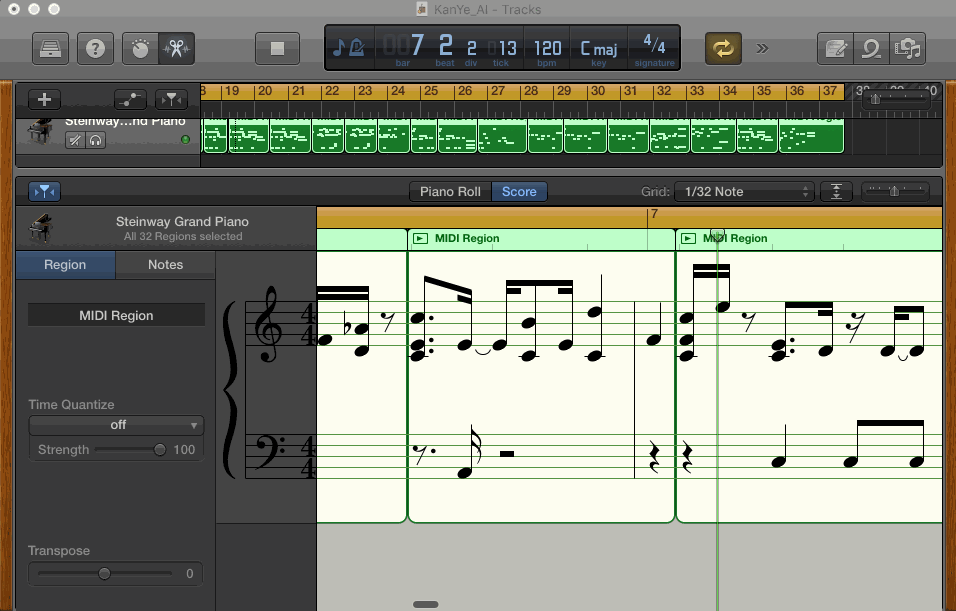
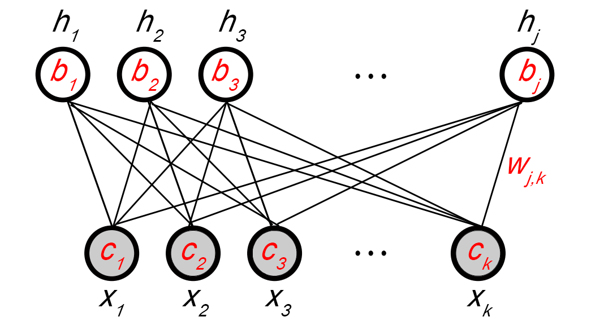
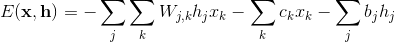

# Music_AI
--



## Overview
Use TensorFlow to generate short sequences of music with an acoustic model called [Restricted Boltzmann Machine](http://deeplearning4j.org/restrictedboltzmannmachine.html)





## Dependencies

* [tensorflow](https://www.tensorflow.org/versions/r0.10/get_started/os_setup.html)
* pandas
* numpy
* msgpack
* glob
* tqdm 

## Get Started

1) Install project requirements


```
pip install -r requirements.txt
```

2) Drop in music files

The training data goes in the midi_data folder. You have to use MIDI files. 


3) Run script

```
python music_generator.py
```

Training will take 5-10 minutes on a modern laptop. The output will be a collection of midi files. 


## Credits

- OG2 [siraj](https://github.com/llSourcell/Music_Generator_Demo)
- OG1 [dshieble](https://github.com/dshieble) 
